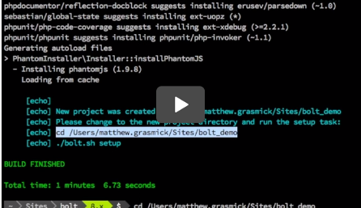

# Bolt

Bolt is a tool that generates new Drupal projects using a standardized template derived from Acquia Professional Services' best practices.

[Creating new Drupal projects with Acquia Bolt - Video](https://www.youtube.com/watch?v=BrsZAyfj2tE)

## Philosophy and Purpose

Bolt is designed to improve efficiency and collaboration across Drupal projects by providing a common set of tools and standardized structure. It was born out of the need to reduce re-work, project set up time, and developer onboarding time.

Its explicit goals are to:

* Provide a standard project template for Drupal based projects
* Provide tools that automate much of the setup and maintenance work for projects
* Document and enforce Drupal standards and best practices via default configuration, automated testing, and continuous integration

It scope is discretely defined. It is *not* intended to provide:

* Drupal application features (e.g., workflow, media, layout, pre-fabbed content types, etc.)
* A local hosting environment
* A replacement for good judgement (as with Drupal, it leaves you the freedom to make mistakes)

## Features

* [Documentation templates](template/README.md)
* [Git Hooks](template/scripts/git-hooks)
    * pre-commit: Checks for Drupal coding standards compliance
    * commit-msg: Check for proper formatting and syntax
* [Acquia Cloud Hooks](template/hooks). Example integrations for third party services such as:
    * Slack
    * New Relic
    * HipChat
* [Testing Framework](template/tests).
    * Behat: default `local.yml` configuration, example tests, `FeatureContext.php`
    * PHPUnit: default tests for ensuring proper functioning of Bolt provided components
* [Project tasks](template/readme/project-tasks.md)
    * Executing tests and validating code
    * Building dependencies
    * (Re)installation of Drupal
    * Production-safe artifact generation and deployment
* [Continuous Integration](template/build/README.md)
    * Travis CI
    * GitHub

## Installation

It isn’t accurate to say that you can “install” Bolt. Rather, you can use Bolt to generate a new project. Within that project, you can then perform common project tasks like build dependencies, install Drupal, run tests, etc.

Follow the instructions in [INSTALL.md](INSTALL.md) to generate a new project using Bolt.

## Keeping Bolt projects up-to-date

"How do I pull down upstream changes from Bolt to my Bolt-generated project?"

This is a popular question, and it's difficult to answer.

Bolt is designed as a "starter kit" rather than a "distribution". It intentionally began with a "fork it and forget it" approach to updates. This is largely due to the fact that Bolt generated files are templates that are meant to be customized, and pulling in upstream updates would wipe out those customizations.

That said, there are components of Bolt that could be treated as dependencies that receive upstream updates. Those components include:

* Project tasks
* Scripts
* Acquia Cloud hooks

The ideal approach would be to split each of these into a separate, versioned projects that could be treated as formal composer.json dependencies, but we don't currently have the resources to maintain all of those projects.

As a stopgap, you can run the following command to pull in upstream updates to specific files and directories in your Bolt generated project:

`./bolt.sh setup:bolt:update`

After running, you can review changes via `git diff` and decide what should be committed.

# Support and contribution

Bolt is provided as an open source tool in the hope that it will enabled developers to easily generate new Drupal projects that conform to Acquia Professional Services' best practices.

Please feel free to contribute to the project or file issues via the GitHub issue queue. When doing so, please keep the following points in mind:

* Bolt is distributed under the GPLv2 license; WITHOUT ANY WARRANTY.
* The project maintainers make no commitment to respond to support requests,
  feature requests, or pull requests.
* All contributions to Bolt will be reviewed for compliance with Drupal Coding
  Standards and best practices as defined by the project maintainer.
* Feature that are part of the [Road Map](https://github.com/acquia/bolt/wiki/Road-Map)
  will be prioritized for inclusion.

Bolt work is currently being tracked in the [Bolt GitHub issue queue]
(https://github.com/acquia/bolt/issues) and organized via a
[Waffle.io Kanban Board](https://waffle.io/acquia/bolt).

## License

Copyright (C) 2016 Acquia, Inc.

This program is free software: you can redistribute it and/or modify it under the terms of the GNU General Public License version 2 as published by the Free Software Foundation.

This program is distributed in the hope that it will be useful, but WITHOUT ANY WARRANTY; without even the implied warranty of MERCHANTABILITY or FITNESS FOR A PARTICULAR PURPOSE.  See the [GNU General Public License](LICENSE.txt) for more details.
